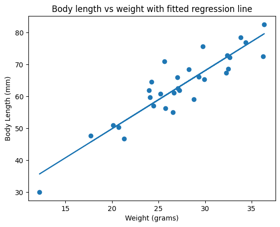
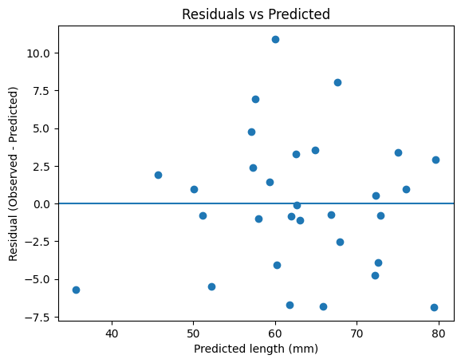
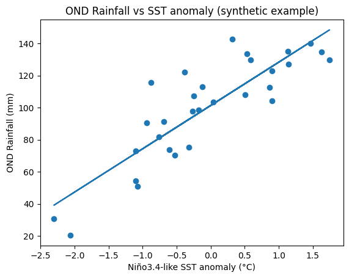
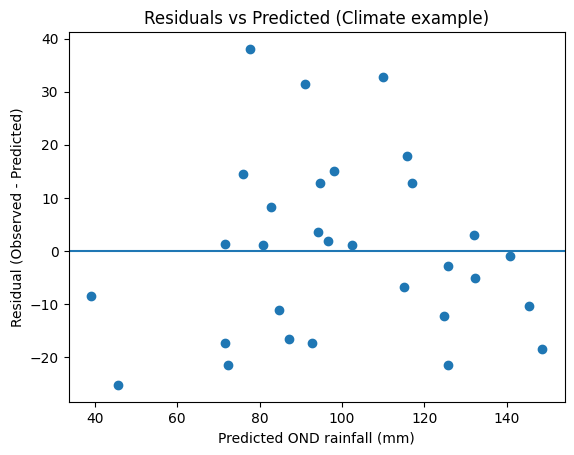

# Linear Regression

This notebook walks through simple linear regression using a clear, step-by-step process:  
1. Problem setup and data  
2. Fitting a regression line  
3. Residuals and Sum of Squared Residuals  
4. R² (how good is the fit?)  
5. Statistical significance (F-test and p-value)  
6. Model assumptions  
7. Exercises  

We'll use synthetic example data that mimics a real scientific question like:  
**Can we predict an organism's length from its weight?**  
You can adapt this to climate questions (e.g. predicting seasonal rainfall from SST anomalies).

## 0. Setup: Import libraries and create example data

We will:
- Import NumPy and scikit-learn
- Create a synthetic dataset: `weight` (x) and `length` (y)
- Visualize later with matplotlib

```python
import numpy as np
from sklearn.linear_model import LinearRegression

# for significance testing
from scipy.stats import f

# plotting
import matplotlib.pyplot as plt

# reproducibility
np.random.seed(0)

# Create synthetic data:
# x = weight in grams
# y = length in mm (roughly linear function of weight + noise)
n = 30
weight = np.random.normal(loc=25, scale=5, size=n)  # predictor x
length = 2.0 * weight + 10 + np.random.normal(loc=0, scale=5, size=n)  # response y

# Reshape for sklearn
X = weight.reshape(-1, 1)
y = length

# Fit linear regression model
model = LinearRegression()
model.fit(X, y)

slope = model.coef_[0]
intercept = model.intercept_

print(f'Intercept (b0): {intercept:.4f}')
print(f'Slope     (b1): {slope:.4f}')
```

```text
Intercept (b0): 13.3680
Slope     (b1): 1.8230
```

## 1. Fitting the regression line

### Goal
We want to model the relationship between an input variable \(x\) (e.g. weight) and an output variable \(y\) (e.g. body length) with a straight line:

\[
\hat{y} = b_0 + b_1 x
\]

- \( \hat{y} \): predicted value of \(y\)  
- \( x \): observed input  
- \( b_0 \): intercept  
- \( b_1 \): slope (how much \(y\) changes if \(x\) increases by 1 unit)

### Least Squares
The regression algorithm chooses \( b_0 \) and \( b_1 \) to minimize the **Sum of Squared Residuals** (defined soon).

In other words, it finds the "best fitting line" that makes predictions as close as possible to the observed data in a squared-error sense.

Below we already fit the model using scikit-learn and extracted:
- `intercept` = \( b_0 \)
- `slope` = \( b_1 \)

Now let's visualize that line together with the data.

```python
# Predicted values for plotting
y_pred_line = model.predict(X)

plt.scatter(weight, y)
plt.plot(weight, y_pred_line)
plt.xlabel("Weight (grams)")
plt.ylabel("Body Length (mm)")
plt.title("Body length vs weight with fitted regression line")
plt.show()
```




### Interpreting the coefficients

- **Slope \(b_1\)**: For each +1 unit in \(x\), how much does \(y\) increase (on average)?  
  Example: If \( b_1 = 2.1 \), then each +1 gram of weight is associated with ~2.1 mm more length.

- **Intercept \(b_0\)**: The predicted \(y\) when \(x = 0\).  
  Sometimes this is meaningful, sometimes it's just a mathematical anchor (e.g. predicting body length when weight = 0 grams may not describe a real organism).

These interpretations are the main "story" you tell domain experts. For example in climate:
> For each +1°C SST anomaly in Niño3.4, OND rainfall increases by X mm.

## 2. Residuals and Sum of Squared Residuals

### Residuals
For each data point \(i\):
\[
\text{residual}_i = y_i - \hat{y}_i
\]

- \( y_i \): observed value  
- \( \hat{y}_i \): model prediction

Residuals measure how far the model is from reality for each observation.

### Sum of Squared Residuals (SSR or \(SS_{\text{res}}\))
\[
SS_{\text{res}} = \sum_i (y_i - \hat{y}_i)^2
\]

Linear regression chooses \( b_0, b_1 \) to make \( SS_{\text{res}} \) as small as possible. This is called **Ordinary Least Squares** (OLS).

```python
# Compute residuals for each point
y_pred = model.predict(X)
residuals = y - y_pred

# Sum of Squared Residuals
SS_res = np.sum((y - y_pred) ** 2)

print("First 5 residuals:", residuals[:5])
print("Sum of Squared Residuals (SS_res):", SS_res)
```

```text
First 5 residuals: [ 3.39128355  3.30064343 -2.51719459 -6.8655477   0.968563  ]
Sum of Squared Residuals (SS_res): 578.4935659628738
```

```python
y
```

```text
array([78.41526059, 65.89238468, 65.3484511 , 72.50494965, 76.93601915,
       51.00896605, 75.65233758, 64.49832716, 57.0311774 , 62.59447127,
       56.19767089, 67.44264538, 59.0790263 , 70.97062714, 61.89037142,
       61.14637177, 68.67681393, 61.83586914, 55.06118778, 50.39534121,
       29.99276904, 68.47069844, 66.0903363 , 46.67518888, 82.5566351 ,
       47.59800261, 60.79017128, 59.64052099, 72.15618168, 72.87988187])
```

```python
y_pred
```

```text
array([75.02397704, 62.59174125, 67.86564569, 79.37049735, 75.96745615,
       50.03608552, 67.60449793, 57.56455325, 58.00334607, 62.68691618,
       60.25720317, 72.2002676 , 65.8812549 , 60.05330836, 62.99013229,
       61.98573362, 72.56310502, 57.07414355, 61.79789922, 51.15892068,
       35.67308811, 64.90210342, 66.82375713, 52.17919639, 79.63357626,
       45.68731427, 59.36131101, 57.2379847 , 72.91586621, 72.33777344])
```

## 3. R²: How much variation did the model explain?

We want to know if the line is actually useful.  
Does knowing \(x\) (weight) help us predict \(y\) (length) better than just using the average length for everyone?

### Total variation in \(y\)
First compute how spread out the observed \(y\) values are around their mean, ignoring \(x\). This is the **Total Sum of Squares**:

\[
SS_{\text{tot}} = \sum_i (y_i - \bar{y})^2
\]

Here, \( \bar{y} \) is the mean of all observed \(y\).

### Coefficient of Determination, \(R^2\)
\[
R^2 = 1 - \frac{SS_{\text{res}}}{SS_{\text{tot}}}
\]

- \(R^2 = 1\): perfect prediction (all points on the line).  
- \(R^2 = 0\): model is no better than just using the average \(y\).  
- Intermediate values: "X% of the variation in \(y\) can be explained using \(x\)."

This is how we communicate usefulness to non-statisticians and decision-makers.

```python
# Compute R^2 manually
y_mean = np.mean(y)
SS_tot = np.sum((y - y_mean) ** 2)

R2_manual = 1 - SS_res / SS_tot

# Compare with scikit-learn's built-in score()
R2_sklearn = model.score(X, y)

print(f"R-squared (manual):  {R2_manual:.4f}")
print(f"R-squared (sklearn): {R2_sklearn:.4f}")

print(f"\nInterpretation: about {R2_sklearn*100:.1f}% of the variation in length can be explained by weight.")
```

```text
R-squared (manual):  0.8345
R-squared (sklearn): 0.8345

Interpretation: about 83.5% of the variation in length can be explained by weight.
```

## 4. Statistical significance: F-test and model p-value

So far, we know the model fits. But is that fit statistically convincing, or could it just be luck?

We compare two models:
1. **Null model**: everyone gets the same prediction = the mean of \(y\)
2. **Regression model**: prediction depends on \(x\)

We test whether the regression model is *significantly better* than the null model.

### F-statistic

For simple linear regression, the F-statistic can be computed from sums of squares:

\[
F = \frac{\big(SS_{\text{tot}} - SS_{\text{res}}\big)/(p_{\text{fit}} - p_{\text{mean}})}{SS_{\text{res}}/(n - p_{\text{fit}})}
\]

Where:
- \(SS_{\text{tot}}\): total variation around the mean  
- \(SS_{\text{res}}\): leftover variation after fitting the regression line  
- \(n\): number of data points  
- \(p_{\text{fit}}\): number of parameters in the regression model  
  - For simple linear regression: slope + intercept = 2  
- \(p_{\text{mean}}\): number of parameters in the null model  
  - Just the mean of \(y\) = 1

We then get a **p-value** from the F-distribution with degrees of freedom:
- \(df_1 = p_{\text{fit}} - p_{\text{mean}}\)
- \(df_2 = n - p_{\text{fit}}\)

If the p-value is very small (commonly \< 0.05), the relationship between \(x\) and \(y\) is considered statistically significant, i.e. unlikely to be just random noise.

```python
n_obs = len(y)
p_fit = 2      # slope + intercept
p_mean = 1     # just the mean

# Mean squares
MS_fit = (SS_tot - SS_res) / (p_fit - p_mean)
MS_error = SS_res / (n_obs - p_fit)

F_stat = MS_fit / MS_error

# Survival function (1-CDF) gives p-value for F-stat >= observed
p_val = f.sf(F_stat, p_fit - p_mean, n_obs - p_fit)

print(f"F statistic: {F_stat:.4f}")
print(f"Model p-value: {p_val:.6f}")

if p_val < 0.05:
    print("\nConclusion: The regression is statistically significant.")
else:
    print("\nConclusion: We do NOT have strong evidence that x predicts y.")
```

```text
F statistic: 141.2013
Model p-value: 0.000000

Conclusion: The regression is statistically significant.
```

## 5. Assumptions of (ordinary) linear regression

These assumptions matter if you want to trust p-values and confidence intervals, or use the model for policy/forecasting.

1. **Linearity**  
   The relationship between \(x\) and \(y\) should be approximately a straight line.  
   If it's curved, a straight line will not capture it well.

2. **Independent errors**  
   Residuals (prediction errors) should be independent from one observation to the next.  
   For time series like monthly rainfall, residuals are often autocorrelated. In that case, simple linear regression is not the right tool without adjustment.

3. **Constant variance (homoscedasticity)**  
   The spread of residuals should be roughly the same for all values of \(x\).  
   If residuals get much bigger when \(x\) increases, we have heteroscedasticity.

4. **Residuals roughly normal**  
   For inference (p-values, confidence intervals), we usually assume residuals are approximately normally distributed.

5. **No single extreme outlier dominating the slope**  
   One extreme point can tilt the line and give a misleading slope and R².

In climate / hydrology work:
- Extreme floods or droughts can act like outliers and heavily influence the line.
- Autocorrelation in time series data (e.g. rainfall by month) often violates "independent errors" and needs time-series methods instead of plain OLS.

## 6. Quick residual diagnostic plot

A fast way to check assumptions is to plot residuals vs. the fitted (predicted) values.

- If the model is appropriate, this plot should look like random scatter around 0.
- If you see a curve or a "fan" shape, that's a warning sign.

```python
plt.scatter(y_pred, residuals)
plt.axhline(0)
plt.xlabel("Predicted length (mm)")
plt.ylabel("Residual (Observed - Predicted)")
plt.title("Residuals vs Predicted")
plt.show()
```



## 7. Exercises / Adaptation

1. **Change the noise level**  
   Re-run the data generation cell with different noise (change `scale=` in the `np.random.normal` call for `length`).  
   - How does R² change?
   - How does the p-value change?

2. **Climate data version**  
   Replace `weight` with something like Niño3.4 SST anomaly, and replace `length` with OND rainfall (mm).  
   - Fit regression.  
   - Interpret slope physically: "For each +1°C in Niño3.4, OND rainfall changes by ___ mm."  
   - Report R² and p-value.

3. **Check residuals**  
   Are residuals randomly scattered around 0? Do you see curvature? If yes, try adding a nonlinear term (like \(x^2\)) and fit a polynomial regression.

This shows how to move from a statistical demo to a domain application (e.g. seasonal rainfall prediction).

## 8. Climate example: Seasonal rainfall prediction from SST 🌧️🌊

Now we connect this to a real climate/science-style question:

**Can we predict OND (October–November–December) seasonal rainfall from sea surface temperature anomalies (SST), for example Niño3.4 SST?**

This is a classic seasonal forecasting question in East Africa:
- When the equatorial Pacific is unusually warm (positive SST anomaly, El Niño), East Africa often sees wetter OND seasons.
- When it's cool (La Niña), rainfall can be reduced.

We'll simulate a small dataset that looks like this relationship.

### Setup
- `sst_anom`: SST anomaly in °C relative to normal (Niño3.4-like index)
- `rain_ond`: seasonal total rainfall (mm) over OND in a region

We'll assume a (roughly) linear relationship:
\[
\text{rain\_ond} \approx 100 + 30 \times \text{sst\_anom} + \text{noise}
\]

Then we fit a simple linear regression:  
\[
\widehat{\text{rain\_ond}} = b_0 + b_1 \cdot \text{sst\_anom}
\]

We'll interpret:
- Slope \(b_1\): "How many mm of OND rainfall change per +1°C SST anomaly?"
- \(R^2\): "How much of OND rainfall variation can SST alone explain?"
- p-value: "Is SST a statistically significant predictor of rainfall?"

> Note: This is *synthetic* data, structured to behave like a typical teleconnection signal. Replace with real SST and rainfall time series in practice.


```python
# Seasonal rainfall vs SST anomaly example (synthetic teleconnection-like data)

np.random.seed(1)

n_clim = 30
sst_anom = np.random.normal(loc=0.0, scale=1.0, size=n_clim)  # Niño3.4-like SST anomaly (°C)
rain_ond = 100 + 30*sst_anom + np.random.normal(loc=0.0, scale=20.0, size=n_clim)  # OND rainfall (mm)

X_clim = sst_anom.reshape(-1, 1)
y_clim = rain_ond

model_climate = LinearRegression()
model_climate.fit(X_clim, y_clim)

b0_clim = model_climate.intercept_
b1_clim = model_climate.coef_[0]

print(f"Climate intercept (b0): {b0_clim:.3f}")
print(f"Climate slope     (b1): {b1_clim:.3f}  mm per 1°C SST anomaly")

```

```text
Climate intercept (b0): 101.353
Climate slope     (b1): 27.032  mm per 1°C SST anomaly
```

```python
# Predictions and scatter + fit line
y_pred_clim = model_climate.predict(X_clim)
y_pred_clim
```

```text
array([145.26332945,  84.81626593,  87.07575492,  72.3486207 ,
       124.74746658,  39.13749672, 148.51981815,  80.77626955,
       109.97784662,  94.61240853, 140.87767218,  45.66304919,
        92.63778182,  90.97158541, 132.00191435,  71.6208386 ,
        96.69233537,  77.62290607, 102.49460966, 117.10833232,
        71.60116149, 132.29803384, 125.7255802 , 114.93707112,
       125.70571762,  82.87070934,  98.03146294,  76.05743579,
        94.11183165, 115.6902226 ])
```

```python
plt.scatter(sst_anom, y_clim)
plt.plot(sst_anom, y_pred_clim)
plt.xlabel("Niño3.4-like SST anomaly (°C)")
plt.ylabel("OND Rainfall (mm)")
plt.title("OND Rainfall vs SST anomaly (synthetic example)")
plt.show()
```



```python
# R² and significance for climate model
resid_clim = y_clim - y_pred_clim
SS_res_clim = np.sum(resid_clim**2)
SS_tot_clim = np.sum((y_clim - np.mean(y_clim))**2)
R2_clim = 1 - SS_res_clim/SS_tot_clim

n_obs_clim = len(y_clim)
p_fit = 2      # slope + intercept
p_mean = 1     # just the mean rainfall

MS_fit_clim = (SS_tot_clim - SS_res_clim) / (p_fit - p_mean)
MS_err_clim = SS_res_clim / (n_obs_clim - p_fit)

F_stat_clim = MS_fit_clim / MS_err_clim
p_val_clim = f.sf(F_stat_clim, p_fit - p_mean, n_obs_clim - p_fit)
```

```python
print(f"""
R² for climate regression: {R2_clim:.3f}
F statistic:               {F_stat_clim:.3f}
p-value:                   {p_val_clim:.6f}
""")
```

```text

R² for climate regression: 0.736
F statistic:               78.144
p-value:                   0.000000
```

```python

if p_val_clim < 0.05:
    print("Conclusion: SST anomaly is a statistically significant predictor of OND rainfall.")
else:
    print("Conclusion: We do not have strong evidence that SST predicts OND rainfall.")
```

```text
Conclusion: SST anomaly is a statistically significant predictor of OND rainfall.
```

```python
# Residual diagnostics for climate model
plt.scatter(y_pred_clim, resid_clim)
plt.axhline(0)
plt.xlabel("Predicted OND rainfall (mm)")
plt.ylabel("Residual (Observed - Predicted)")
plt.title("Residuals vs Predicted (Climate example)")
plt.show()
```



### Interpreting this in climate language

- **Slope \(b_1\)**:  
  If \( b_1 = 28 \), you can say:  
  "A +1°C warming in Niño3.4 is associated with about +28 mm more OND rainfall in this region."  
  This is *extremely* powerful for seasonal early warning.

- **R²**:  
  If \(R^2 = 0.45\), you can say:  
  "About 45% of the year-to-year variation in OND rainfall can be explained using just SST anomalies."  
  That's huge for climate work, because seasonal rainfall is noisy.

- **p-value**:  
  A very small p-value means it's unlikely this relationship is just random chance.  
  Operational forecasters often use this to justify using SST as an early predictor in seasonal outlooks.

**BUT:** Real climate systems are multivariate. SST isn't the only driver.  
Wind patterns, soil moisture, Indian Ocean Dipole, etc., also matter.

This motivates **multiple regression**.


## 9. Multiple regression and Adjusted R²

So far we've used *one* predictor at a time (simple linear regression).  
But for real seasonal prediction, you might include more than one variable, e.g.:

- Pacific SST anomaly (Niño3.4)
- Soil moisture / land moisture memory
- Regional wind or humidity index

This is **multiple linear regression**:
\[
\hat{y} = b_0 + b_1 x_1 + b_2 x_2 + \dots + b_p x_p
\]

where:
- \(y\): OND rainfall (mm)
- \(x_1\): SST anomaly (°C)
- \(x_2\): soil moisture anomaly (unitless index)
- etc.

### Why multiple regression?
Because rainfall isn't controlled by just one process.  
Adding predictors can improve R² and predictive skill.

### BUT WARNING
Adding more predictors will *always* keep raw R² the same or increase it.  
You can "game" R² by throwing in junk predictors.

That's why we also look at **Adjusted R²**.

### Adjusted R²
Adjusted R² penalizes you for adding extra predictors that don't really help:
\[
R^2_{\text{adj}} = 1 - (1 - R^2) \frac{n - 1}{n - p - 1}
\]

Where:
- \(n\) = number of observations  
- \(p\) = number of predictors (not counting the intercept)

If you add a useless predictor, Adjusted R² can go **down**.  
If you add a helpful predictor, Adjusted R² usually goes **up**.

We'll simulate a realistic case:
- Rainfall depends on both SST anomaly and a soil moisture index.


```python
# Multiple regression with two predictors (SST + soil moisture-like index)

np.random.seed(2)

n_multi = 40
sst_multi = np.random.normal(0.0, 1.0, size=n_multi)

# soil moisture index that is partly related to SST but also has its own variation
soil_moisture_idx = 0.5*sst_multi + np.random.normal(0.0, 0.5, size=n_multi)

# True rainfall model uses BOTH predictors
rain_multi = (
    100
    + 25*sst_multi             # SST contribution
    + 15*soil_moisture_idx     # land surface memory contribution
    + np.random.normal(0.0, 20.0, size=n_multi)
)

X_multi = np.column_stack([sst_multi, soil_moisture_idx])
y_multi = rain_multi

model_multi = LinearRegression()
model_multi.fit(X_multi, y_multi)

b0_multi = model_multi.intercept_
b_multi  = model_multi.coef_    # [b1, b2]

print("Multiple regression intercept (b0):", round(b0_multi, 3))
print("Coefficients [b1_sst, b2_soil]:", np.round(b_multi, 3))

# R² and Adjusted R²
R2_multi = model_multi.score(X_multi, y_multi)
n_obs_multi = len(y_multi)
p_predictors = X_multi.shape[1]  # number of predictors (sst, soil moisture)

R2_adj_multi = 1 - (1 - R2_multi) * (n_obs_multi - 1)/(n_obs_multi - p_predictors - 1)

print(f"R² (multiple predictors):        {R2_multi:.4f}")
print(f"Adjusted R² (penalized extra):   {R2_adj_multi:.4f}")
```

```text
Multiple regression intercept (b0): 102.069
Coefficients [b1_sst, b2_soil]: [16.302 26.791]
R² (multiple predictors):        0.7485
Adjusted R² (penalized extra):   0.7349
```

```python
print("""
Interpretation:
- R² tells us how much of the variation in OND rainfall we can explain with BOTH SST and soil moisture.
- Adjusted R² tells us whether adding the extra predictor(s) was actually worthwhile, after penalizing complexity.
""")
```

```text

Interpretation:
- R² tells us how much of the variation in OND rainfall we can explain with BOTH SST and soil moisture.
- Adjusted R² tells us whether adding the extra predictor(s) was actually worthwhile, after penalizing complexity.
```

### Interpreting multiple regression for climate forecasting

Example story you would tell a climate service user or a ministry:

- "OND rainfall can be predicted using both Pacific SST and land moisture memory.  
  A +1°C SST anomaly, holding soil moisture constant, increases expected seasonal rainfall by about **b1** mm."

- "Independently, wetter soils (positive soil moisture anomaly) add **b2** mm to seasonal rainfall, even after controlling for SST."

- "Together, these two predictors explain **R² × 100%** of the variation in OND rainfall from year to year."

- "Adjusted R² is high, which tells us the second predictor is not just noise. It's giving us real additional skill."

Why this matters operationally:
- Seasonal forecast bulletins can justify including land-surface information, not only SST.
- You can compare models:
  - **Model A:** SST only  
  - **Model B:** SST + Soil moisture  
  If Adjusted R² goes up from A → B, you keep soil moisture in the operational model.

---

**Workflow for your real data:**  
1. Build a dataframe with columns: OND_rain_mm, nino34_SST, soil_moisture_anom, wind_index, etc.  
2. Fit simple regression (rain ~ nino34_SST).  
3. Fit multiple regression (rain ~ nino34_SST + soil_moisture + wind_index ...).  
4. Compare Adjusted R².    
5. Report which predictors are physically meaningful and statistically useful.  
6. Check residuals again for structure or bias (do we systematically underpredict drought years?).  

At this point you are doing real seasonal prediction science, not just demo statistics.  

