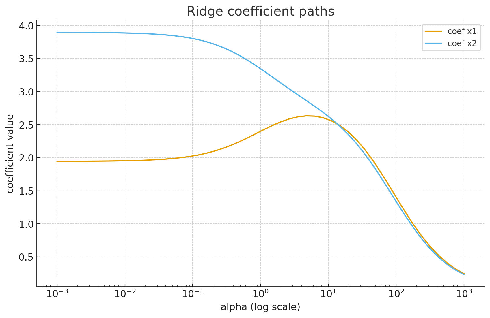
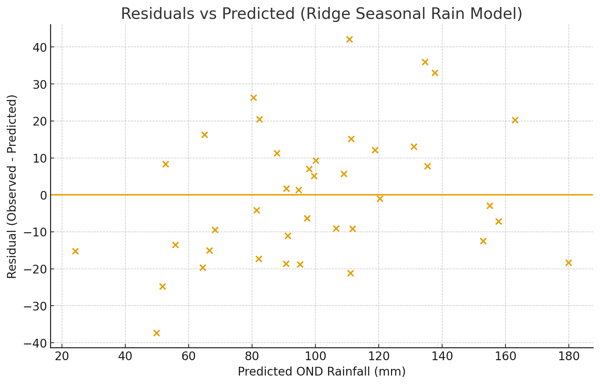

# Ridge Regression (L2 Regularization)

This notebook explains **Ridge Regression** (also called **L2 regularization**) in practical, applied terms.

We will:  
1. Build intuition for *why* we regularize  
2. Derive the Ridge cost function  
3. Train Ridge models in Python  
4. See how the regularization strength (`alpha`) changes the model  
5. Talk about interpretation and assumptions  
6. Apply Ridge to a seasonal rainfall forecasting style problem (rainfall ~ SST, soil moisture, etc.)  

Ridge Regression is especially useful when:  
- You have **correlated predictors** (multicollinearity)  
- You have **many predictors** and don't want huge, unstable coefficients  
- You care about **generalization / robustness**, not just fitting perfectly on training data  

We'll connect this to seasonal climate prediction, where predictors like SST indices and land moisture can be correlated.


## 1. Concept

Ordinary Least Squares (OLS) linear regression finds coefficients \( \beta \) that minimize the **Sum of Squared Residuals**:


$$
\text{Loss}_\text{OLS} = \sum_i (y_i - \hat{y}_i)^2
= \sum_i \big(y_i - (b_0 + \beta_1 x_{i1} + \beta_2 x_{i2} + \dots)\big)^2
$$


Ridge Regression modifies this by **adding a penalty** on the *size* of the coefficients:


$$
\text{Loss}_\text{Ridge} = \sum_i (y_i - \hat{y}_i)^2 \;+\; \alpha \sum_j \beta_j^2
$$


- The first term is the same as OLS: fit the data.
- The second term is the **L2 penalty**: keep coefficients small.
- \( \alpha \) (alpha) controls how strong the penalty is.

**Why do this?**
- If predictors are highly correlated, OLS can give huge, unstable coefficients.
- Ridge shrinks coefficients toward 0 → more stable, lower variance, better generalization.
- In forecasting (e.g. seasonal rainfall), stability often matters more than perfectly explaining the past.

Key intuition:
- **Small α (alpha close to 0):** behaves like normal linear regression.
- **Large α:** coefficients are heavily shrunk towards 0.


## 2. Math Details

### Ridge Objective
For data matrix \(X\) (size \(n \times p\)), target vector \(y\) (size \(n \times 1\)), and coefficient vector \(\beta\) (size \(p \times 1\)), Ridge solves:


$$
\min_{\beta} \; \|y - X\beta\|^2 + \alpha \|\beta\|^2
$$


Here:
- \(\|y - X\beta\|^2 = (y - X\beta)^\top (y - X\beta)\)
- \(\|\beta\|^2 = \beta^\top \beta = \sum_j \beta_j^2\)

### Closed-form solution
Ridge has an analytical solution:


$$
\hat{\beta}_\text{ridge} = (X^\top X + \alpha I)^{-1} X^\top y
$$


Compare to OLS:

$$
\hat{\beta}_\text{OLS} = (X^\top X)^{-1} X^\top y
$$


- If \(X^\top X\) is close to singular (because predictors are correlated), \((X^\top X)^{-1}\) is unstable.
- Ridge adds \(\alpha I\), which makes the matrix more invertible and stabilizes the solution.

This is why Ridge is considered a **shrinkage method** and a **regularizer**:
it prefers solutions where coefficients are not extreme.


## 3. Code Setup: Imports and Synthetic Data

We'll create a regression problem where predictors are highly correlated.  
Think of this like climate predictors where two indices are partially measuring the same phenomenon.

We'll then compare:
- Ordinary LinearRegression (no penalty)
- Ridge Regression with different `alpha` values


```python
import numpy as np
import matplotlib.pyplot as plt
from sklearn.linear_model import LinearRegression, Ridge
from sklearn.metrics import r2_score, mean_squared_error
import pandas as pd

np.random.seed(42)

n = 60

# Create two highly correlated predictors
x1 = np.random.normal(0, 1, size=n)
x2 = x1 * 0.9 + np.random.normal(0, 0.2, size=n)  # strongly correlated with x1

# True relationship that depends on both x1 and x2
y_true = 5 + 3.5*x1 + 2.0*x2
y = y_true + np.random.normal(0, 1.5, size=n)  # add noise

X = np.column_stack([x1, x2])

print("Correlation between x1 and x2:", np.corrcoef(x1, x2)[0,1])
```

    Correlation between x1 and x2: 0.9753517517269679


## 4. Fit OLS vs Ridge

We'll fit:
- Ordinary `LinearRegression()`
- Ridge with several `alpha` values

We'll compare:
- Coefficients
- R² (goodness of fit, higher is better on training here)
- RMSE (root mean squared error)

Notice how coefficients shrink as alpha increases.


```python
alphas = [0, 0.1, 1, 10, 100]

results = []

for a in alphas:
    if a == 0:
        # plain linear regression (equivalent to Ridge with alpha=0)
        model = LinearRegression()
    else:
        model = Ridge(alpha=a)
    model.fit(X, y)
    y_hat = model.predict(X)
    
    coef = model.coef_
    intercept = model.intercept_
    r2 = r2_score(y, y_hat)
    rmse = mean_squared_error(y, y_hat, squared=False)
    
    results.append({
        "alpha": a,
        "intercept": intercept,
        "coef_x1": coef[0],
        "coef_x2": coef[1],
        "R2": r2,
        "RMSE": rmse
    })

pd.DataFrame(results)
```


<div>
<style scoped>
    .dataframe tbody tr th:only-of-type {
        vertical-align: middle;
    }

    .dataframe tbody tr th {
        vertical-align: top;
    }

    .dataframe thead th {
        text-align: right;
    }
</style>
<table border="1" class="dataframe">
  <thead>
    <tr style="text-align: right;">
      <th></th>
      <th>alpha</th>
      <th>intercept</th>
      <th>coef_x1</th>
      <th>coef_x2</th>
      <th>R2</th>
      <th>RMSE</th>
    </tr>
  </thead>
  <tbody>
    <tr>
      <th>0</th>
      <td>0.0</td>
      <td>5.162904</td>
      <td>1.945566</td>
      <td>3.896952</td>
      <td>0.924995</td>
      <td>1.429377</td>
    </tr>
    <tr>
      <th>1</th>
      <td>0.1</td>
      <td>5.162414</td>
      <td>2.026794</td>
      <td>3.803672</td>
      <td>0.924983</td>
      <td>1.429488</td>
    </tr>
    <tr>
      <th>2</th>
      <td>1.0</td>
      <td>5.156188</td>
      <td>2.400088</td>
      <td>3.346596</td>
      <td>0.924535</td>
      <td>1.433748</td>
    </tr>
    <tr>
      <th>3</th>
      <td>10.0</td>
      <td>5.083092</td>
      <td>2.579103</td>
      <td>2.626346</td>
      <td>0.914574</td>
      <td>1.525440</td>
    </tr>
    <tr>
      <th>4</th>
      <td>100.0</td>
      <td>4.721212</td>
      <td>1.404116</td>
      <td>1.338786</td>
      <td>0.668929</td>
      <td>3.003044</td>
    </tr>
  </tbody>
</table>
</div>


### Coefficient shrinkage

Let's visualize how the coefficients for `x1` and `x2` change with `alpha`.

As `alpha` grows, Ridge will pull the coefficients toward 0.  
This is the "shrinkage" effect.

When predictors are correlated, shrinking both together can be *more* stable than letting OLS pick extreme, wobbly values.


```python
# We'll refit on a grid of alpha values to trace coefficient paths
alpha_grid = np.logspace(-3, 3, 50)
coef_x1_list = []
coef_x2_list = []

for a in alpha_grid:
    model = Ridge(alpha=a)
    model.fit(X, y)
    coef_x1_list.append(model.coef_[0])
    coef_x2_list.append(model.coef_[1])

plt.plot(alpha_grid, coef_x1_list, label="coef x1")
plt.plot(alpha_grid, coef_x2_list, label="coef x2")
plt.xscale("log")
plt.xlabel("alpha (log scale)")
plt.ylabel("coefficient value")
plt.title("Ridge coefficient paths")
plt.legend()
plt.show()
```


    

    


## 5. How to interpret Ridge results

1. **Coefficients get smaller (shrinkage)**  
   - As `alpha` increases, both `x1` and `x2` coefficients move toward 0.  
   - This prevents any single predictor from having an extreme weight.

2. **Multicollinearity becomes less dangerous**  
   - When predictors are correlated, OLS can assign huge positive weight to one feature and huge negative weight to another, even if physically that makes no sense.
   - Ridge discourages that instability.

3. **Better generalization**  
   - Lower variance in the coefficients often means better predictions on *unseen* data.
   - In climate forecasting, we care a lot about generalization because we must predict next season, not just explain history.

4. **Alpha is a tuning parameter**  
   - You usually pick `alpha` via cross-validation (e.g. `RidgeCV` in scikit-learn).
   - Small alpha → almost OLS.  
   - Large alpha → heavy regularization.

5. **R² might drop slightly on training data**  
   - Ridge might fit the training data *slightly* worse than OLS (R² a bit lower),  
     but it often predicts new data *better*, which is the real goal.

---

**Plain language story for decision makers:**  
> "Ridge Regression gives us a more reliable, physically reasonable model by preventing any single predictor from dominating, especially when predictors overlap in what they describe."

That's exactly what you want in systems like seasonal rainfall where SST, soil moisture, and circulation indices are all partly telling the same story.


## 6. Assumptions (and differences vs OLS)

Ridge Regression still assumes a *linear* relationship in the predictors, but changes how we estimate the coefficients.

### Core assumptions (mostly inherited from linear regression):
1. **Linearity**  
   The target \(y\) is (approximately) a linear combination of the predictors.

2. **Independent errors**  
   Residuals should be independent from sample to sample.  
   This is often violated in time series (e.g. rainfall by year/month).

3. **Constant variance (homoscedasticity)**  
   Residual spread shouldn't systematically grow/shrink with fitted value.

4. **No severe outliers dominating the fit**  
   Ridge can help with stability, but extreme outliers can still hurt.

### What Ridge improves:
- **Multicollinearity tolerance**  
  Ridge handles correlated predictors much better than OLS.

- **Variance control**  
  Coefficients are stabilized and less noisy, which improves robustness.

### What Ridge does *not* magically solve:
- Nonlinearity. If the real world is nonlinear, you may still need nonlinear features or models.
- Autocorrelation in residuals from climate time series. For seasonal forecasting, we often still have lag structure that must be handled carefully (e.g. use lag features or explicitly model autocorrelation).


## 7. Seasonal Rainfall Forecasting from SST (Ridge Version)

Now let's revisit the seasonal forecasting style problem:

**Goal:** Predict OND rainfall using:  
- Pacific SST anomaly (e.g. Niño3.4)
- Soil moisture index (land surface memory)

In reality, these predictors can be correlated:
- Hotter SST years can also influence soil moisture patterns via circulation and rainfall feedback.
- That correlation can create multicollinearity, which hurts OLS stability.

This is where Ridge helps.

We'll:
1. Generate synthetic climate-style predictors
2. Fit OLS and Ridge
3. Compare coefficients and R²
4. Interpret what Ridge is doing physically


```python
np.random.seed(7)

n_clim = 40

# Predictor 1: Pacific SST anomaly (°C)
sst_anom = np.random.normal(0.0, 1.0, size=n_clim)

# Predictor 2: soil moisture index (land surface 'memory')
# Partly related to SST to simulate multicollinearity
soil_moisture_idx = 0.6*sst_anom + np.random.normal(0.0, 0.6, size=n_clim)

# True OND rainfall model uses BOTH predictors
rain_ond = (
    100
    + 28*sst_anom           # ocean driver
    + 15*soil_moisture_idx  # land memory
    + np.random.normal(0.0, 20.0, size=n_clim)
)

X_clim = np.column_stack([sst_anom, soil_moisture_idx])
y_clim = rain_ond

# Fit OLS
ols_model = LinearRegression()
ols_model.fit(X_clim, y_clim)
ols_pred = ols_model.predict(X_clim)
ols_r2 = r2_score(y_clim, ols_pred)

# Fit Ridge with moderate alpha
ridge_model = Ridge(alpha=10.0)
ridge_model.fit(X_clim, y_clim)
ridge_pred = ridge_model.predict(X_clim)
ridge_r2 = r2_score(y_clim, ridge_pred)

print("=== OLS ===")
print("Intercept:", round(ols_model.intercept_, 3))
print("Coefficients [SST, Soil]:", np.round(ols_model.coef_, 3))
print("R²:", round(ols_r2, 4))

print("\n=== Ridge (alpha=10.0) ===")
print("Intercept:", round(ridge_model.intercept_, 3))
print("Coefficients [SST, Soil]:", np.round(ridge_model.coef_, 3))
print("R²:", round(ridge_r2, 4))

# Residual scatter for Ridge
ridge_resid = y_clim - ridge_pred

plt.scatter(ridge_pred, ridge_resid)
plt.axhline(0)
plt.xlabel("Predicted OND Rainfall (mm)")
plt.ylabel("Residual (Observed - Predicted)")
plt.title("Residuals vs Predicted (Ridge Seasonal Rain Model)")
plt.show()
```

    === OLS ===
    Intercept: 104.241
    Coefficients [SST, Soil]: [30.208 10.793]
    R²: 0.8497
    
    === Ridge (alpha=10.0) ===
    Intercept: 103.732
    Coefficients [SST, Soil]: [24.125 12.138]
    R²: 0.832


    

    


### Interpreting the seasonal forecast Ridge model

When you explain this to climate services / ministries / NMHS teams, say things like:

1. **Physical meaning of coefficients**  
   - The SST coefficient tells us how OND rainfall changes per +1°C anomaly in Niño3.4-like SST, *controlling for soil moisture*.
   - The soil moisture coefficient tells us how OND rainfall responds to land moisture memory, *controlling for SST*.

   Ridge keeps these coefficients from blowing up when SST and soil moisture are correlated.  
   That makes the story physically believable.

2. **Why Ridge is valuable operationally**  
   - Seasonal forecasts must be stable from month to month.  
   - If tiny changes in last week's SST estimate cause huge swings in coefficients, decision makers will lose trust.
   - Ridge reduces that swing.

3. **R² comparison**  
   - OLS might show slightly higher R² on historical data.  
   - Ridge might have a slightly lower R² in training, but will usually predict future years more reliably.

4. **Residuals check**  
   - We still want residuals scattered (no obvious curve, no strong bias).  
   - If we see structure, maybe we are missing another climate driver (e.g. Indian Ocean Dipole, wind patterns in the Indian Ocean, etc.).

---

**Bottom line to communicate:**  
Ridge is not just "fancy math."  
It is a practical tool to build *stable*, *interpretable*, *operational* seasonal rainfall forecasting models using correlated climate predictors.


## 8. Exercises

1. **Alpha tuning**
   - In the seasonal rainfall example, try different `alpha` values like `0.1`, `1`, `10`, `100`.
   - How do the SST and soil moisture coefficients change?
   - Which alpha gives you coefficients that look most physically reasonable (not extreme, not flipped sign)?

2. **Hold-out test**
   - Split your climate data into "train" (first 30 years) and "test" (most recent 10 years).
   - Train both OLS and Ridge on train only.
   - Compare R² and RMSE on the *test* set.  
   - Which generalizes better? That matters for real forecast skill.

3. **Add another predictor**
   - Add a synthetic "wind index" or "humidity index" that is partially correlated with SST.
   - Refit OLS and Ridge.
   - Watch how OLS can go unstable, while Ridge remains controlled.

4. **Physical storytelling**
   - Practice writing 2-sentence summaries for each model:
     - "A +1°C warm anomaly in Niño3.4 is linked to about ___ mm increase in OND rainfall, controlling for land moisture."
     - "Soil moisture memory is associated with ___ mm additional rainfall, controlling for SST."
   - This is what stakeholders will actually remember.
