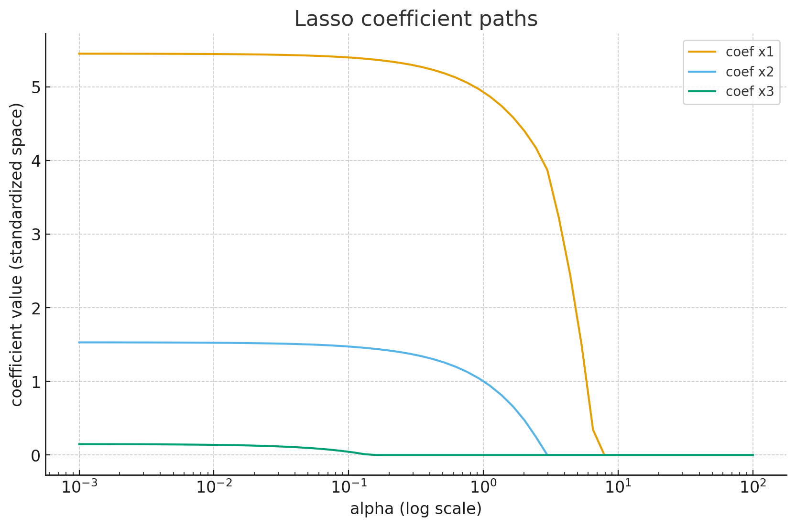
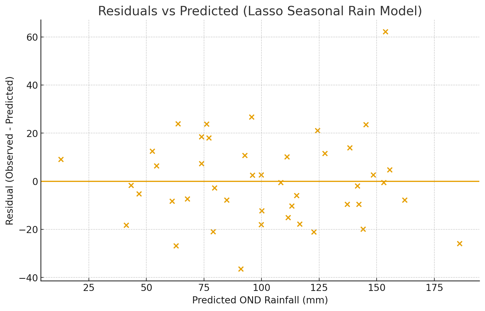

# Lasso Regression (L1 Regularization)

This notebook walks through **Lasso Regression** (also called **L1 regularization**).  
It follows the same style as the Ridge notebook but focuses on a different type of penalty. 

We will cover:
1. Concept: Why Lasso?  
2. Math: The L1 penalty  
3. Code: Fitting Lasso and comparing to OLS  
4. Coefficient paths as `alpha` changes  
5. Interpretation and when to use Lasso  
6. Assumptions and cautions  
7. Seasonal rainfall forecasting demo (rainfall ~ SST, soil moisture, wind index)  

Why Lasso matters in climate / seasonal prediction:
- It can **select features** automatically by shrinking some coefficients exactly to zero.
- That means it can tell you which predictors are most important for rainfall prediction.

## 1. Concept

Ordinary Least Squares (OLS) linear regression minimizes the sum of squared residuals:

$$
\text{Loss}_{\text{OLS}} = \sum_i (y_i - \hat{y}_i)^2
$$

Lasso Regression modifies this by adding a penalty on the absolute value of the coefficients:

$$
\text{Loss}_{\text{Lasso}} = \sum_i (y_i - \hat{y}_i)^2 + \alpha \sum_j |\beta_j|
$$

- First term: fit the data.  
- Second term: **L1 penalty** — punishes large coefficients.  
- \(\alpha\): strength of the penalty.

Key difference from Ridge:
- Ridge (L2) penalty is \(\sum_j \beta_j^2\). It shrinks coefficients but usually does not make them exactly zero.  
- Lasso (L1) penalty is \(\sum_j |\beta_j|\). It can shrink some coefficients all the way to zero.

That means Lasso can do feature selection — it can set some coefficients to exactly 0.

This is valuable for high-dimensional climate predictors (SST indices, moisture indices, winds, pressure, etc.) where many predictors are correlated or redundant.

## 2. Math Details

### Lasso Objective
Given:
- \(X\): matrix of predictors (size \(n \times p\))
- \(y\): target (size \(n \times 1\))
- \(\beta\): vector of coefficients (size \(p \times 1\))

Lasso solves:
$$
\min_{\beta} \; \|y - X\beta\|^2 + \alpha \|\beta\|_1
$$
where
$$
\|\beta\|_1 = \sum_j |\beta_j|
$$

### Geometric intuition
- The L1 penalty makes the "constraint region" have sharp corners (like a diamond).
- The optimal solution often hits those corners, which correspond to some \(\beta_j = 0\).
- This is why Lasso naturally sets some coefficients exactly to zero.

### Practical note about scaling
Because Lasso penalizes coefficients directly, **feature scaling matters**:
- If one predictor has units of °C and another is mm of rainfall, the raw coefficients aren't comparable in magnitude.
- You almost always want to standardize/scale predictors before fitting Lasso.

## 3. Code Setup: Imports and Synthetic Data

We'll make a regression problem with 3 predictors:
- `x1`, `x2` are useful
- `x3` is mostly noise

We'll fit:
- OLS (no regularization)
- Lasso with different `alpha` values

We'll standardize the predictors before fitting Lasso because Lasso is sensitive to scale.


```python
import numpy as np
import matplotlib.pyplot as plt
import pandas as pd

from sklearn.linear_model import LinearRegression, Lasso
from sklearn.preprocessing import StandardScaler
from sklearn.pipeline import Pipeline
from sklearn.metrics import r2_score, mean_squared_error
```


```python
np.random.seed(123)

n = 80

# Create predictors
x1 = np.random.normal(0, 1, size=n)
x2 = 0.8 * x1 + np.random.normal(0, 0.4, size=n)  # correlated with x1
x3 = np.random.normal(0, 1, size=n)               # mostly noise / weak relevance

# True relationship mostly uses x1 and x2, weakly x3
y_true = 10 + 4.0*x1 + 2.5*x2 + 0.2*x3
y = y_true + np.random.normal(0, 2.0, size=n)
```


```python
X = np.column_stack([x1, x2, x3])

print("Correlations:")
print(np.corrcoef(X.T))
```

    Correlations:
    [[ 1.          0.91891875 -0.0402275 ]
     [ 0.91891875  1.         -0.04437629]
     [-0.0402275  -0.04437629  1.        ]]


## 4. Fit OLS vs Lasso

We'll compare models at different `alpha` values.

- For `alpha = 0`, Lasso would reduce to OLS in spirit, but scikit-learn's `Lasso` doesn't allow `alpha=0`.  
  We'll handle that by separately fitting `LinearRegression` for baseline.

- For each alpha, we will:
  - Fit a Pipeline(StandardScaler → Lasso(alpha))
  - Get coefficients
  - Compute R² and RMSE (root mean squared error)

We'll see how coefficients shrink and some become exactly 0 as alpha increases.


```python
alphas = [0, 0.01, 0.1, 1.0, 10.0]

results = []

# Baseline OLS (no scaling needed for OLS here)
ols_model = LinearRegression()
ols_model.fit(X, y)
ols_pred = ols_model.predict(X)
ols_r2 = r2_score(y, ols_pred)
ols_rmse = mean_squared_error(y, ols_pred, squared=False)

results.append({
    "alpha": 0,
    "coef_x1": ols_model.coef_[0],
    "coef_x2": ols_model.coef_[1],
    "coef_x3": ols_model.coef_[2],
    "R2": ols_r2,
    "RMSE": ols_rmse,
    "model": "OLS"
})

for a in alphas[1:]:  # skip alpha=0 because we already did OLS
    pipe = Pipeline([
        ("scaler", StandardScaler()),
        ("lasso", Lasso(alpha=a, max_iter=10000))
    ])
    pipe.fit(X, y)
    y_hat = pipe.predict(X)

    # After fitting, grab the lasso step coefficients (these are on the scaled feature space)
    lasso_coef = pipe.named_steps["lasso"].coef_
    r2 = r2_score(y, y_hat)
    rmse = mean_squared_error(y, y_hat, squared=False)

    results.append({
        "alpha": a,
        "coef_x1": lasso_coef[0],
        "coef_x2": lasso_coef[1],
        "coef_x3": lasso_coef[2],
        "R2": r2,
        "RMSE": rmse,
        "model": "Lasso"
    })

pd.DataFrame(results)
```


<div>
<style scoped>
    .dataframe tbody tr th:only-of-type {
        vertical-align: middle;
    }

    .dataframe tbody tr th {
        vertical-align: top;
    }

    .dataframe thead th {
        text-align: right;
    }
</style>
<table border="1" class="dataframe">
  <thead>
    <tr style="text-align: right;">
      <th></th>
      <th>alpha</th>
      <th>coef_x1</th>
      <th>coef_x2</th>
      <th>coef_x3</th>
      <th>R2</th>
      <th>RMSE</th>
      <th>model</th>
    </tr>
  </thead>
  <tbody>
    <tr>
      <th>0</th>
      <td>0.00</td>
      <td>4.749012</td>
      <td>1.493542</td>
      <td>0.170313</td>
      <td>0.927643</td>
      <td>1.921927</td>
      <td>OLS</td>
    </tr>
    <tr>
      <th>1</th>
      <td>0.01</td>
      <td>5.447752</td>
      <td>1.525484</td>
      <td>0.138382</td>
      <td>0.927639</td>
      <td>1.921981</td>
      <td>Lasso</td>
    </tr>
    <tr>
      <th>2</th>
      <td>0.10</td>
      <td>5.401092</td>
      <td>1.474183</td>
      <td>0.044228</td>
      <td>0.927226</td>
      <td>1.927461</td>
      <td>Lasso</td>
    </tr>
    <tr>
      <th>3</th>
      <td>1.00</td>
      <td>4.932116</td>
      <td>1.003171</td>
      <td>0.000000</td>
      <td>0.906802</td>
      <td>2.181230</td>
      <td>Lasso</td>
    </tr>
    <tr>
      <th>4</th>
      <td>10.00</td>
      <td>0.000000</td>
      <td>0.000000</td>
      <td>-0.000000</td>
      <td>0.000000</td>
      <td>7.144915</td>
      <td>Lasso</td>
    </tr>
  </tbody>
</table>
</div>


### Coefficient paths

Let's trace how each coefficient changes (and may hit zero) as we sweep alpha across a range.

When alpha is very large, Lasso can zero out everything except maybe the intercept.  
This is the "feature selection" effect in action.


```python
alpha_grid = np.logspace(-3, 2, 60)  # from 0.001 to 100
coef_x1_list = []
coef_x2_list = []
coef_x3_list = []

for a in alpha_grid:
    pipe = Pipeline([
        ("scaler", StandardScaler()),
        ("lasso", Lasso(alpha=a, max_iter=10000))
    ])
    pipe.fit(X, y)
    c = pipe.named_steps["lasso"].coef_
    coef_x1_list.append(c[0])
    coef_x2_list.append(c[1])
    coef_x3_list.append(c[2])

plt.plot(alpha_grid, coef_x1_list, label="coef x1")
plt.plot(alpha_grid, coef_x2_list, label="coef x2")
plt.plot(alpha_grid, coef_x3_list, label="coef x3")
plt.xscale("log")
plt.xlabel("alpha (log scale)")
plt.ylabel("coefficient value (standardized space)")
plt.title("Lasso coefficient paths")
plt.legend()
plt.show()
```


    

    


## 5. How to interpret Lasso results

1. **Automatic feature selection**  
   - As `alpha` increases, some coefficients become exactly 0.  
   - That means Lasso is telling you: "This predictor is not important for predicting y (given the others)."

2. **Simplicity and explainability**  
   - A Lasso model with just 1–2 nonzero predictors is easy to explain to decision-makers:  
     *"We're basing seasonal rainfall prediction mainly on SST anomaly and soil moisture; wind index didn't add useful skill."*

3. **Handles many predictors**  
   - You can throw in 20 climate indices. Lasso will try to keep only the useful ones.  
   - OLS will try to fit all of them and can become unstable or overfit.

4. **But be careful with correlated predictors**  
   - Ridge tends to **share** weight across correlated predictors.  
   - Lasso tends to **pick one** of the correlated predictors and drop the rest.  
   - So if SST and soil moisture are correlated, Lasso might keep SST and zero soil moisture, or vice versa.  
     That does **not** mean the dropped predictor is physically irrelevant — it just means it's redundant *statistically*.

5. **Training fit vs future skill**  
   - High `alpha` can drop useful variables and underfit.  
   - Very low `alpha` can behave like OLS and overfit.
   - Usually we pick `alpha` by cross-validation (e.g. `LassoCV`).

## 6. Assumptions and cautions

Lasso is still a linear model in the predictors.

### Assumptions mostly inherited from linear regression:
1. **Linearity**  
   We assume \(y\) can be modeled as a linear combination of predictors.

2. **Independent errors**  
   Residuals should not be autocorrelated in time (important in seasonal climate work).

3. **Constant variance (homoscedasticity)**  
   The scatter of residuals shouldn't systematically grow/shrink with fitted values.

4. **No extreme, dominant outliers**  
   A single extreme year (e.g. a severe flood season) can still distort the fit.

### Lasso-specific cautions:
- **Scaling is mandatory** for a fair comparison between predictors. One predictor measured in °C and another in mm must be scaled before Lasso.
- **Correlated predictors**: Lasso can arbitrarily "choose" one and zero out the rest. That can make interpretation political in climate discussions ("Why did you drop soil moisture? It matters!").
- **Instability at high alpha**: If alpha is too large, Lasso can zero out almost everything and become useless.

## 7. Seasonal Rainfall Forecasting from SST (Lasso Version)

Now let's build a small seasonal climate forecasting scenario like you'd present to ICPAC / NMHS:

**Goal:** Predict OND rainfall using:
- Pacific SST anomaly (Niño3.4-like)
- Soil moisture memory index
- Low-level wind index (circulation / moisture transport)

We'll:
1. Generate synthetic predictors where some are correlated
2. Fit OLS
3. Fit Lasso with scaling
4. See which predictors Lasso keeps

The idea: Lasso can tell us which drivers are most informative *this season* and produce a simple, explainable forecast model.


```python
np.random.seed(999)

n_years = 45

# Climate-style predictors
sst_anom = np.random.normal(0.0, 1.0, size=n_years)  # e.g. Niño3.4 SST anomaly (°C)

soil_moisture_idx = 0.6*sst_anom + np.random.normal(0.0, 0.6, size=n_years)
# soil moisture partly tracks SST-driven wetness

wind_index = np.random.normal(0.0, 1.0, size=n_years)
# say this represents low-level moisture transport; not always aligned w/ SST

# True rainfall depends mostly on SST and soil moisture; wind_index is weaker
rain_ond = (
    100
    + 25*sst_anom
    + 15*soil_moisture_idx
    + 3*wind_index
    + np.random.normal(0.0, 20.0, size=n_years)
)

X_clim = np.column_stack([sst_anom, soil_moisture_idx, wind_index])
y_clim = rain_ond

# Fit OLS for reference
ols2 = LinearRegression()
ols2.fit(X_clim, y_clim)
ols2_pred = ols2.predict(X_clim)

print("=== OLS seasonal model ===")
print("Coefficients [SST, Soil, Wind]:", np.round(ols2.coef_, 3))
print("R²:", round(r2_score(y_clim, ols2_pred), 4))

# Fit Lasso with scaling
lasso_pipe = Pipeline([
    ("scaler", StandardScaler()),
    ("lasso", Lasso(alpha=0.1, max_iter=10000))
])
lasso_pipe.fit(X_clim, y_clim)
lasso_pred = lasso_pipe.predict(X_clim)

print("\n=== Lasso seasonal model (alpha=0.1) ===")
print("Coefficients [SST, Soil, Wind] (standardized space):",
      np.round(lasso_pipe.named_steps['lasso'].coef_, 3))
print("R²:", round(r2_score(y_clim, lasso_pred), 4))

# Residuals vs predicted for Lasso
lasso_resid = y_clim - lasso_pred
plt.scatter(lasso_pred, lasso_resid)
plt.axhline(0)
plt.xlabel("Predicted OND Rainfall (mm)")
plt.ylabel("Residual (Observed - Predicted)")
plt.title("Residuals vs Predicted (Lasso Seasonal Rain Model)")
plt.show()
```

    === OLS seasonal model ===
    Coefficients [SST, Soil, Wind]: [25.313 17.867 -0.258]
    R²: 0.8227
    
    === Lasso seasonal model (alpha=0.1) ===
    Coefficients [SST, Soil, Wind] (standardized space): [25.147 15.519 -0.125]
    R²: 0.8227


    

    


### Interpreting the seasonal Lasso model

When communicating this to seasonal forecast stakeholders:

1. **Which predictors does Lasso keep?**  
   - If Lasso shrinks `wind_index` close to 0, it's saying wind doesn't add much beyond SST + soil moisture this season.
   - If it keeps `wind_index`, then circulation is providing additional predictive signal that is *not* captured by SST or soil moisture.

2. **Policy / advisory language:**  
   - "OND rainfall anomalies are primarily driven by Pacific SST and land moisture memory.  
      Wind circulation plays a smaller, secondary role."

3. **Why this matters:**  
   - You can generate OND rainfall guidance using only the predictors that Lasso keeps.  
   - That helps you design a lightweight early warning product:  
     *"Monitor these 2 indices each month and update expected OND rainfall."*

4. **Stability vs interpretability:**  
   - Ridge gives smoother, more stable coefficients (good for operations).  
   - Lasso gives sparse, focused predictors (good for communication and variable selection).  
   - In practice, forecasters often examine both.

---

**Bottom line to communicate:**  
Lasso helps us **identify and communicate the key climate drivers** for a given target season by zeroing out weak predictors, which makes the forecast story clearer to non-technical partners.


## 8. Exercises

1. **Alpha sweep for seasonal data**  
   - Change `alpha` in the seasonal Lasso model (`alpha=0.01`, `0.1`, `1`, `10`).  
   - Watch which predictors survive and which go to 0.  
   - Which alpha gives a realistic climate story?  

2. **Train/test split**  
   - Split the seasonal data (first 35 years = train, last 10 years = test).  
   - Fit OLS and Lasso on train only.  
   - Compare R² and RMSE on test to evaluate robustness of the forecast skill.  

3. **Physical interpretation exercise**  
   - Write 2-sentence summaries for each predictor kept by Lasso:  
     - "For each +1°C Niño3.4 anomaly, OND rainfall increases by ___ mm, holding other drivers constant."  
     - "A positive soil moisture anomaly contributes ___ mm, indicating land memory of wet conditions."  
   - This turns raw coefficients into a forecast narrative for ministries / agriculture / flood early warning teams.  

4. **Add Indian Ocean info**  
   - Add a synthetic "IOD index" predictor correlated with SST.    
   - Does Lasso keep SST, IOD, both, or just one?    
   - How would you explain that choice physically to East Africa seasonal outlook stakeholders?  

