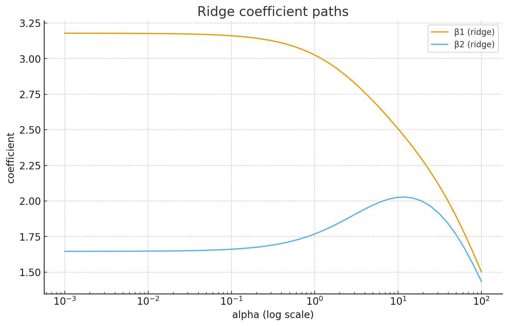

# Ridge vs Lasso Regression

This notebook compares **Ridge (L2)** and **Lasso (L1)** regression with clear visuals and hands‑on code, aligned with the core ideas covered in the *Ridge vs Lasso Regression.

We’ll:  
1. Build intuition for the difference between L2 and L1 penalties.  
2. Show the **geometry** in coefficient space (elliptical RSS contours + circle vs diamond constraints).  
3. Compare **coefficient paths** as regularization strength increases.  
4. Provide a **seasonal rainfall forecasting** example (OND rainfall ~ SST + land moisture + wind).  

## 1) Concept

- **OLS** finds coefficients that minimize squared error but can be unstable with **correlated predictors**.
- **Ridge (L2)** adds a penalty on the **squared magnitude** of coefficients. It **shrinks** coefficients but rarely sets them exactly to 0. Great for **stability** and the **grouping effect** when predictors are correlated.
- **Lasso (L1)** adds a penalty on the **absolute magnitude** of coefficients. It can shrink some coefficients **exactly to 0** (i.e., **feature selection**).
- **Scaling matters** for penalized models—standardize predictors before fitting so penalties are comparable across features.


## 2) Math

For predictors \(X \in \mathbb{R}^{n \times p}\), target \(y \in \mathbb{R}^n\), coefficients \(\beta \in \mathbb{R}^p\):

- **OLS objective**  


$$
\min_\beta \; \|y - X\beta\|_2^2
$$


- **Ridge (L2) objective**  


$$
\min_\beta \; \|y - X\beta\|_2^2 + \alpha \|\beta\|_2^2
$$


- **Lasso (L1) objective**  


$$
\min_\beta \; \|y - X\beta\|_2^2 + \alpha \|\beta\|_1
$$


**Geometry (constraint view):**
- Ridge constraint: \(\|\beta\|_2 \leq r\) → **circle** in 2D.
- Lasso constraint: \(\|\beta\|_1 \leq t\) → **diamond** in 2D.
- The OLS solution is where RSS contours are minimized; with constraints/penalties, solutions occur where an RSS contour first **touches** the constraint region (tangent point).

## 3) Code Setup and Synthetic Data

We’ll create a small synthetic example with two **correlated** predictors to visualize the RSS surface in \((\beta_1,\beta_2)\) space, then plot solutions for OLS, Ridge, and Lasso. We'll also show coefficient paths as regularization increases.


```python
import numpy as np
import pandas as pd
import matplotlib.pyplot as plt

from sklearn.preprocessing import StandardScaler
from sklearn.linear_model import LinearRegression, Ridge, Lasso
from sklearn.pipeline import Pipeline
from sklearn.metrics import r2_score, mean_squared_error

# Reproducibility
np.random.seed(0)

# Synthetic data (two correlated predictors)
n = 80
x1 = np.random.normal(0, 1, size=n)
x2 = 0.85*x1 + np.random.normal(0, 0.3, size=n)  # strongly correlated with x1
X_raw = np.column_stack([x1, x2])

# True model uses both
y_true = 5 + 3.0*x1 + 2.0*x2
y = y_true + np.random.normal(0, 1.5, size=n)

# Standardize features for penalized models (and for coefficient space visuals)
scaler = StandardScaler()
X = scaler.fit_transform(X_raw)

# OLS (no scaling needed for intercept, but we use X standardized to match coefficient space)
ols = LinearRegression().fit(X, y)
beta_ols = ols.coef_
intercept_ols = ols.intercept_

beta_ols, intercept_ols
```


    (array([3.17865369, 1.64624954]), 4.902805039448815)


## 4) Visualizing RSS contours with L2 circle and L1 diamond

We compute the **RSS** on a grid of \((\beta_1,\beta_2)\) values (using standardized X), plot its **contours** (ellipses), and overlay:

- The **Ridge** solution (for a chosen \(\alpha\)) and a circle with radius equal to \(\|\beta_{\text{ridge}}\|_2\).
- The **Lasso** solution (for a chosen \(\alpha\)) and a diamond with radius equal to \(\|\beta_{\text{lasso}}\|_1\).

This shows where the RSS contours “touch” the constraint shapes.


```python
# Choose representative alpha values
alpha_ridge = 5.0
alpha_lasso = 0.2

ridge = Ridge(alpha=alpha_ridge)
ridge.fit(X, y)
beta_ridge = ridge.coef_
intercept_ridge = ridge.intercept_

lasso = Lasso(alpha=alpha_lasso, max_iter=10000)
lasso.fit(X, y)
beta_lasso = lasso.coef_
intercept_lasso = lasso.intercept_

# Build grid for beta space around OLS solution
b1_vals = np.linspace(beta_ols[0]-2, beta_ols[0]+2, 200)
b2_vals = np.linspace(beta_ols[1]-2, beta_ols[1]+2, 200)
B1, B2 = np.meshgrid(b1_vals, b2_vals)

# Compute RSS(beta) on the grid (no penalty for the contour plot)
RSS = np.zeros_like(B1)
for i in range(B1.shape[0]):
    for j in range(B1.shape[1]):
        beta = np.array([B1[i,j], B2[i,j]])
        y_hat = X @ beta + intercept_ols  # baseline with OLS intercept
        RSS[i,j] = np.sum((y - y_hat)**2)

# Constraint radii to pass through the solutions
r_l2 = np.sqrt(np.sum(beta_ridge**2))            # circle radius for ridge
t_l1 = np.abs(beta_lasso).sum()                   # diamond radius for lasso

# Plot contours + constraints + points
fig = plt.figure()
cs = plt.contour(B1, B2, RSS, levels=10)
plt.clabel(cs, inline=True, fontsize=8)

# Circle: (b1)^2 + (b2)^2 = r_l2^2
theta = np.linspace(0, 2*np.pi, 400)
circle_x = r_l2*np.cos(theta)
circle_y = r_l2*np.sin(theta)
plt.plot(circle_x, circle_y, label="L2 circle (|β|₂ = ||β_ridge||₂)")

# Diamond: |b1| + |b2| = t_l1
d = t_l1
diamond_x = np.array([0,  d,  0, -d, 0])
diamond_y = np.array([d,  0, -d,  0, d])
plt.plot(diamond_x, diamond_y, label="L1 diamond (|β|₁ = ||β_lasso||₁)")

# Plot solutions
plt.scatter(beta_ols[0],   beta_ols[1],   marker="x", s=80, label="OLS solution")
plt.scatter(beta_ridge[0], beta_ridge[1], marker="o", s=40, label=f"Ridge (α={alpha_ridge})")
plt.scatter(beta_lasso[0], beta_lasso[1], marker="s", s=40, label=f"Lasso (α={alpha_lasso})")

plt.xlabel(r"$\beta_1$")
plt.ylabel(r"$\beta_2$")
plt.title("RSS contours with L2 circle and L1 diamond in coefficient space")
plt.legend()
plt.show()
```


    

    


## 5) Coefficient paths vs regularization strength

We sweep \(\alpha\) over a log scale and plot the coefficient paths for **Ridge** and **Lasso**.  
- Ridge paths **shrink smoothly** toward 0.  
- Lasso paths can hit **exactly 0**, demonstrating **feature selection**.


```python
alpha_grid = np.logspace(-3, 2, 50)

# Ridge paths
coef_ridge = []
for a in alpha_grid:
    m = Ridge(alpha=a)
    m.fit(X, y)
    coef_ridge.append(m.coef_)
coef_ridge = np.array(coef_ridge)

# Lasso paths
coef_lasso = []
for a in alpha_grid:
    m = Lasso(alpha=a, max_iter=10000)
    m.fit(X, y)
    coef_lasso.append(m.coef_)
coef_lasso = np.array(coef_lasso)

# Plot Ridge paths
plt.plot(alpha_grid, coef_ridge[:,0], label="β1 (ridge)")
plt.plot(alpha_grid, coef_ridge[:,1], label="β2 (ridge)")
plt.xscale("log")
plt.xlabel("alpha (log scale)")
plt.ylabel("coefficient")
plt.title("Ridge coefficient paths")
plt.legend()
plt.show()

# Plot Lasso paths
plt.plot(alpha_grid, coef_lasso[:,0], label="β1 (lasso)")
plt.plot(alpha_grid, coef_lasso[:,1], label="β2 (lasso)")
plt.xscale("log")
plt.xlabel("alpha (log scale)")
plt.ylabel("coefficient")
plt.title("Lasso coefficient paths")
plt.legend()
plt.show()
```


    

    


    

    


## 6) Interpretation

- **Ridge**: shrinks all coefficients; **keeps correlated predictors together** (grouping). Useful when predictors share information and you want stability.  
- **Lasso**: can set some coefficients **exactly to 0**; useful for **feature selection**. With correlated predictors, it may **pick one** and drop the others.
- **Training vs Generalization**: Slightly lower training \(R^2\) with regularization can lead to **better predictions** on new data (reduced variance).
- **Alpha choice**: Pick \(\alpha\) using cross‑validation (e.g., `RidgeCV`, `LassoCV`).

## 7) Assumptions

Similar to linear regression:    
1. **Linearity** between predictors and response.  
2. **Independent errors** (be careful with time series like seasonal rainfall).  
3. **Homoscedasticity** (roughly constant error variance).  
4. **Outliers** can still distort results.  

Penalized models add:
- **Feature scaling** is important (standardize predictors).
- **Model selection** (Lasso) vs **stability** (Ridge) trade‑offs. Choose based on the problem and validation metrics.


## 8) Seasonal Forecast Example (OND rainfall ~ SST + Soil Moisture + Wind)

We simulate OND rainfall prediction from climate drivers:
- `sst_anom`: Niño3.4‑like SST anomaly (°C)
- `soil_moisture_idx`: land moisture memory (partly correlated with SST)
- `wind_index`: low‑level moisture transport (less correlated)

We’ll compare **Ridge vs Lasso** and see how they differ in selecting/driving predictors.


```python
np.random.seed(123)

n_years = 45
sst_anom = np.random.normal(0.0, 1.0, size=n_years)
soil_moisture_idx = 0.6*sst_anom + np.random.normal(0.0, 0.6, size=n_years)
wind_index = np.random.normal(0.0, 1.0, size=n_years)

# True seasonal model
rain_ond = 100 + 24*sst_anom + 14*soil_moisture_idx + 4*wind_index + np.random.normal(0.0, 20.0, size=n_years)

Xc_raw = np.column_stack([sst_anom, soil_moisture_idx, wind_index])
yc = rain_ond

# Train/Test split by time (simulate forecast realism)
split = 35
X_train, X_test = Xc_raw[:split], Xc_raw[split:]
y_train, y_test = yc[:split], yc[split:]

# Pipelines with scaling
ridge = Pipeline([("scaler", StandardScaler()), ("ridge", Ridge(alpha=10.0))])
lasso = Pipeline([("scaler", StandardScaler()), ("lasso", Lasso(alpha=0.15, max_iter=10000))])

ridge.fit(X_train, y_train)
lasso.fit(X_train, y_train)

def get_params(pipe):
    last = list(pipe.named_steps.values())[-1]
    return last.intercept_, last.coef_

int_ridge, coef_ridge = get_params(ridge)
int_lasso, coef_lasso = get_params(lasso)

# Evaluate
ridge_pred = ridge.predict(X_test)
lasso_pred = lasso.predict(X_test)

ridge_r2 = r2_score(y_test, ridge_pred)
lasso_r2 = r2_score(y_test, lasso_pred)
ridge_rmse = mean_squared_error(y_test, ridge_pred, squared=False)
lasso_rmse = mean_squared_error(y_test, lasso_pred, squared=False)

summary = pd.DataFrame({
    "Model": ["Ridge", "Lasso"],
    "Intercept": [int_ridge, int_lasso],
    "coef_SST": [coef_ridge[0], coef_lasso[0]],
    "coef_Soil": [coef_ridge[1], coef_lasso[1]],
    "coef_Wind": [coef_ridge[2], coef_lasso[2]],
    "Test_R2": [ridge_r2, lasso_r2],
    "Test_RMSE": [ridge_rmse, lasso_rmse],
})
summary
```


<div>
<style scoped>
    .dataframe tbody tr th:only-of-type {
        vertical-align: middle;
    }

    .dataframe tbody tr th {
        vertical-align: top;
    }

    .dataframe thead th {
        text-align: right;
    }
</style>
<table border="1" class="dataframe">
  <thead>
    <tr style="text-align: right;">
      <th></th>
      <th>Model</th>
      <th>Intercept</th>
      <th>coef_SST</th>
      <th>coef_Soil</th>
      <th>coef_Wind</th>
      <th>Test_R2</th>
      <th>Test_RMSE</th>
    </tr>
  </thead>
  <tbody>
    <tr>
      <th>0</th>
      <td>Ridge</td>
      <td>101.029524</td>
      <td>19.94227</td>
      <td>14.965567</td>
      <td>5.383856</td>
      <td>0.756758</td>
      <td>13.357931</td>
    </tr>
    <tr>
      <th>1</th>
      <td>Lasso</td>
      <td>101.029524</td>
      <td>25.20494</td>
      <td>15.304289</td>
      <td>6.635975</td>
      <td>0.723529</td>
      <td>14.241122</td>
    </tr>
  </tbody>
</table>
</div>


## 9) Exercises

1. **Alpha tuning**: For the seasonal example, sweep `alpha` for both Ridge and Lasso and track Test R²/RMSE. Which balances accuracy and interpretability best?
2. **Add IOD**: Add a synthetic Indian Ocean Dipole index correlated with SST. How do Ridge and Lasso treat it?
3. **Diagnostics**: Plot residuals vs predictions for the seasonal models. Any curvature or heteroscedasticity?
4. **Communication**: Turn coefficients into a 2‑sentence seasonal outlook for stakeholders:  
   *"A +1°C Niño3.4 anomaly is associated with +__ mm OND rainfall, controlling for other drivers; land moisture memory contributes +__ mm."*

